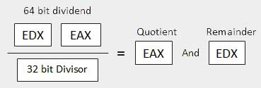

# Assembly - Arithmetic Instructions

## The INC Instruction

The INC instruction is used for incrementing an operand by one. It works on a single operand that can be either in a register or in memory.

### Syntax

The INC instruction has the following syntax −

```
INC destination

```

The operand *destination* could be an 8-bit, 16-bit or 32-bit operand.

### Example

```
INC EBX	     ; Increments 32-bit register
INC DL       ; Increments 8-bit register
INC [count]  ; Increments the count variable
```

## The DEC Instruction

The DEC instruction is used for decrementing an operand by one. It works on a single operand that can be either in a register or in memory.

### Syntax

The DEC instruction has the following syntax −

```
DEC destination

```

The operand *destination* could be an 8-bit, 16-bit or 32-bit operand.

### Example

```
segment .data
   count dw  0
   value db  15
	
segment .text
   inc [count]
   dec [value]
	
   mov ebx, count
   inc word [ebx]
	
   mov esi, value
   dec byte [esi]
```

## The ADD and SUB Instructions

The ADD and SUB instructions are used for performing simple addition/subtraction of binary data in byte, word and doubleword size, i.e., for adding or subtracting 8-bit, 16-bit or 32-bit operands, respectively.

### Syntax

The ADD and SUB instructions have the following syntax −

```
ADD/SUB	destination, source

```

The ADD/SUB instruction can take place between −

- Register to register
- Memory to register
- Register to memory
- Register to constant data
- Memory to constant data

However, like other instructions, memory-to-memory operations are not possible using ADD/SUB instructions. An ADD or SUB operation sets or clears the overflow and carry flags.

### Example

The following example will ask two digits from the user, store the digits in the EAX and EBX register, respectively, add the values, store the result in a memory location '*res*' and finally display the result.

```
SYS_EXIT  equ 1
SYS_READ  equ 3
SYS_WRITE equ 4
STDIN     equ 0
STDOUT    equ 1

segment .data 

   msg1 db "Enter a digit ", 0xA,0xD 
   len1 equ $- msg1 

   msg2 db "Please enter a second digit", 0xA,0xD 
   len2 equ $- msg2 

   msg3 db "The sum is: "
   len3 equ $- msg3

segment .bss

   num1 resb 2 
   num2 resb 2 
   res resb 1    

section	.text
   global _start    ;must be declared for using gcc
	
_start:             ;tell linker entry point
   mov eax, SYS_WRITE         
   mov ebx, STDOUT         
   mov ecx, msg1         
   mov edx, len1 
   int 0x80                

   mov eax, SYS_READ 
   mov ebx, STDIN  
   mov ecx, num1 
   mov edx, 2
   int 0x80            

   mov eax, SYS_WRITE        
   mov ebx, STDOUT         
   mov ecx, msg2          
   mov edx, len2         
   int 0x80

   mov eax, SYS_READ  
   mov ebx, STDIN  
   mov ecx, num2 
   mov edx, 2
   int 0x80        

   mov eax, SYS_WRITE         
   mov ebx, STDOUT         
   mov ecx, msg3          
   mov edx, len3         
   int 0x80

   ; moving the first number to eax register and second number to ebx
   ; and subtracting ascii '0' to convert it into a decimal number
	
   mov eax, [num1]
   sub eax, '0'
	
   mov ebx, [num2]
   sub ebx, '0'

   ; add eax and ebx
   add eax, ebx
   ; add '0' to to convert the sum from decimal to ASCII
   add eax, '0'

   ; storing the sum in memory location res
   mov [res], eax

   ; print the sum 
   mov eax, SYS_WRITE        
   mov ebx, STDOUT
   mov ecx, res         
   mov edx, 1        
   int 0x80

exit:    
   
   mov eax, SYS_EXIT   
   xor ebx, ebx 
   int 0x80
```

When the above code is compiled and executed, it produces the following result −

```
Enter a digit:
3
Please enter a second digit:
4
The sum is:
7

```

**The program with hardcoded variables −**

```
section	.text
   global _start    ;must be declared for using gcc
	
_start:             ;tell linker entry point
   mov	eax,'3'
   sub     eax, '0'
	
   mov 	ebx, '4'
   sub     ebx, '0'
   add 	eax, ebx
   add	eax, '0'
	
   mov 	[sum], eax
   mov	ecx,msg	
   mov	edx, len
   mov	ebx,1	;file descriptor (stdout)
   mov	eax,4	;system call number (sys_write)
   int	0x80	;call kernel
	
   mov	ecx,sum
   mov	edx, 1
   mov	ebx,1	;file descriptor (stdout)
   mov	eax,4	;system call number (sys_write)
   int	0x80	;call kernel
	
   mov	eax,1	;system call number (sys_exit)
   int	0x80	;call kernel
	
section .data
   msg db "The sum is:", 0xA,0xD 
   len equ $ - msg   
   segment .bss
   sum resb 1
```

When the above code is compiled and executed, it produces the following result −

```
The sum is:
7

```

## The MUL/IMUL Instruction

There are two instructions for multiplying binary data. The MUL (Multiply) instruction handles unsigned data and the IMUL (Integer Multiply) handles signed data. Both instructions affect the Carry and Overflow flag.

### Syntax

The syntax for the MUL/IMUL instructions is as follows −

```
MUL/IMUL multiplier

```

Multiplicand in both cases will be in an accumulator, depending upon the size of the multiplicand and the multiplier and the generated product is also stored in two registers depending upon the size of the operands. Following section explains MUL instructions with three different cases −

| SN   | Scenarios                                |
| ---- | ---------------------------------------- |
| 1    | **When two bytes are multiplied -**The multiplicand is in the AL register, and the multiplier is a byte in the memory or in another register. The product is in AX. High-order 8 bits of the product is stored in AH and the low-order 8 bits are stored in AL. |
| 2    | **When two one-word values are multiplied -**The multiplicand should be in the AX register, and the multiplier is a word in memory or another register. For example, for an instruction like MUL DX, you must store the multiplier in DX and the multiplicand in AX.The resultant product is a doubleword, which will need two registers. The high-order (leftmost) portion gets stored in DX and the lower-order (rightmost) portion gets stored in AX. |
| 3    | **When two doubleword values are multiplied -**When two doubleword values are multiplied, the multiplicand should be in EAX and the multiplier is a doubleword value stored in memory or in another register. The product generated is stored in the EDX:EAX registers, i.e., the high order 32 bits gets stored in the EDX register and the low order 32-bits are stored in the EAX register. |

### Example

```
MOV AL, 10
MOV DL, 25
MUL DL
...
MOV DL, 0FFH	; DL= -1
MOV AL, 0BEH	; AL = -66
IMUL DL
```

### Example

The following example multiplies 3 with 2, and displays the result −

```
section	.text
   global _start    ;must be declared for using gcc
	
_start:             ;tell linker entry point

   mov	al,'3'
   sub     al, '0'
	
   mov 	bl, '2'
   sub     bl, '0'
   mul 	bl
   add	al, '0'
	
   mov 	[res], al
   mov	ecx,msg	
   mov	edx, len
   mov	ebx,1	;file descriptor (stdout)
   mov	eax,4	;system call number (sys_write)
   int	0x80	;call kernel
	
   mov	ecx,res
   mov	edx, 1
   mov	ebx,1	;file descriptor (stdout)
   mov	eax,4	;system call number (sys_write)
   int	0x80	;call kernel
	
   mov	eax,1	;system call number (sys_exit)
   int	0x80	;call kernel

section .data
msg db "The result is:", 0xA,0xD 
len equ $- msg   
segment .bss
res resb 1
```

When the above code is compiled and executed, it produces the following result −

```
The result is:
6

```

## The DIV/IDIV Instructions

The division operation generates two elements - a **quotient** and a **remainder**. In case of multiplication, overflow does not occur because double-length registers are used to keep the product. However, in case of division, overflow may occur. The processor generates an interrupt if overflow occurs.

The DIV (Divide) instruction is used for unsigned data and the IDIV (Integer Divide) is used for signed data.

### Syntax

The format for the DIV/IDIV instruction −

```
DIV/IDIV	divisor

```

The dividend is in an accumulator. Both the instructions can work with 8-bit, 16-bit or 32-bit operands. The operation affects all six status flags. Following section explains three cases of division with different operand size −

| SN   | Scenarios                                |
| ---- | ---------------------------------------- |
| 1    | **When the divisor is 1 byte -**The dividend is assumed to be in the AX register (16 bits). After division, the quotient goes to the AL register and the remainder goes to the AH register. |
| 2    | **When the divisor is 1 word -**The dividend is assumed to be 32 bits long and in the DX:AX registers. The high-order 16 bits are in DX and the low-order 16 bits are in AX. After division, the 16-bit quotient goes to the AX register and the 16-bit remainder goes to the DX register. |
| 3    | **When the divisor is doubleword -**The dividend is assumed to be 64 bits long and in the EDX:EAX registers. The high-order 32 bits are in EDX and the low-order 32 bits are in EAX. After division, the 32-bit quotient goes to the EAX register and the 32-bit remainder goes to the EDX register. |

### Example

The following example divides 8 with 2. The **dividend 8** is stored in the **16-bit AX register** and the **divisor 2** is stored in the **8-bit BL register**.

```
section	.text
   global _start    ;must be declared for using gcc
	
_start:             ;tell linker entry point
   mov	ax,'8'
   sub     ax, '0'
	
   mov 	bl, '2'
   sub     bl, '0'
   div 	bl
   add	ax, '0'
	
   mov 	[res], ax
   mov	ecx,msg	
   mov	edx, len
   mov	ebx,1	;file descriptor (stdout)
   mov	eax,4	;system call number (sys_write)
   int	0x80	;call kernel
	
   mov	ecx,res
   mov	edx, 1
   mov	ebx,1	;file descriptor (stdout)
   mov	eax,4	;system call number (sys_write)
   int	0x80	;call kernel
	
   mov	eax,1	;system call number (sys_exit)
   int	0x80	;call kernel
	
section .data
msg db "The result is:", 0xA,0xD 
len equ $- msg   
segment .bss
res resb 1
```

When the above code is compiled and executed, it produces the following result −

```
The result is:
4
```