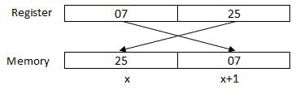
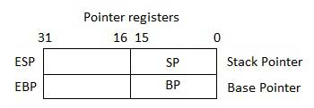
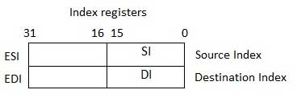
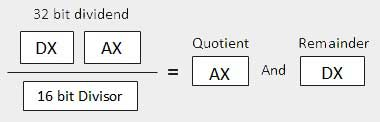

# Assembly - Quick Guide

# Assembly - Introduction

## What is Assembly Language?

Each personal computer has a microprocessor that manages the computer's arithmetical, logical, and control activities.

Each family of processors has its own set of instructions for handling various operations such as getting input from keyboard, displaying information on screen and performing various other jobs. These set of instructions are called 'machine language instructions'.

A processor understands only machine language instructions, which are strings of 1's and 0's. However, machine language is too obscure and complex for using in software development. So, the low-level assembly language is designed for a specific family of processors that represents various instructions in symbolic code and a more understandable form.

## Advantages of Assembly Language

Having an understanding of assembly language makes one aware of −

- How programs interface with OS, processor, and BIOS;
- How data is represented in memory and other external devices;
- How the processor accesses and executes instruction;
- How instructions access and process data;
- How a program accesses external devices.

Other advantages of using assembly language are −

- It requires less memory and execution time;
- It allows hardware-specific complex jobs in an easier way;
- It is suitable for time-critical jobs;
- It is most suitable for writing interrupt service routines and other memory resident programs.

## Basic Features of PC Hardware

The main internal hardware of a PC consists of processor, memory, and registers. Registers are processor components that hold data and address. To execute a program, the system copies it from the external device into the internal memory. The processor executes the program instructions.

The fundamental unit of computer storage is a bit; it could be ON (1) or OFF (0). A group of nine related bits makes a byte, out of which eight bits are used for data and the last one is used for parity. According to the rule of parity, the number of bits that are ON (1) in each byte should always be odd.

So, the parity bit is used to make the number of bits in a byte odd. If the parity is even, the system assumes that there had been a parity error (though rare), which might have been caused due to hardware fault or electrical disturbance.

The processor supports the following data sizes −

- Word: a 2-byte data item
- Doubleword: a 4-byte (32 bit) data item
- Quadword: an 8-byte (64 bit) data item
- Paragraph: a 16-byte (128 bit) area
- Kilobyte: 1024 bytes
- Megabyte: 1,048,576 bytes

## Binary Number System

Every number system uses positional notation, i.e., each position in which a digit is written has a different positional value. Each position is power of the base, which is 2 for binary number system, and these powers begin at 0 and increase by 1.

The following table shows the positional values for an 8-bit binary number, where all bits are set ON.

| Bit value                           | 1    | 1    | 1    | 1    | 1    | 1    | 1    | 1    |
| ----------------------------------- | ---- | ---- | ---- | ---- | ---- | ---- | ---- | ---- |
| Position value as a power of base 2 | 128  | 64   | 32   | 16   | 8    | 4    | 2    | 1    |
| Bit number                          | 7    | 6    | 5    | 4    | 3    | 2    | 1    | 0    |

The value of a binary number is based on the presence of 1 bits and their positional value. So, the value of a given binary number is −

1 + 2 + 4 + 8 +16 + 32 + 64 + 128 = 255

which is same as 28 - 1.

## Hexadecimal Number System

Hexadecimal number system uses base 16. The digits in this system range from 0 to 15. By convention, the letters A through F is used to represent the hexadecimal digits corresponding to decimal values 10 through 15.

Hexadecimal numbers in computing is used for abbreviating lengthy binary representations. Basically, hexadecimal number system represents a binary data by dividing each byte in half and expressing the value of each half-byte. The following table provides the decimal, binary, and hexadecimal equivalents −

| Decimal number | Binary representation | Hexadecimal representation |
| -------------- | --------------------- | -------------------------- |
| 0              | 0                     | 0                          |
| 1              | 1                     | 1                          |
| 2              | 10                    | 2                          |
| 3              | 11                    | 3                          |
| 4              | 100                   | 4                          |
| 5              | 101                   | 5                          |
| 6              | 110                   | 6                          |
| 7              | 111                   | 7                          |
| 8              | 1000                  | 8                          |
| 9              | 1001                  | 9                          |
| 10             | 1010                  | A                          |
| 11             | 1011                  | B                          |
| 12             | 1100                  | C                          |
| 13             | 1101                  | D                          |
| 14             | 1110                  | E                          |
| 15             | 1111                  | F                          |

To convert a binary number to its hexadecimal equivalent, break it into groups of 4 consecutive groups each, starting from the right, and write those groups over the corresponding digits of the hexadecimal number.

**Example** − Binary number 1000 1100 1101 0001 is equivalent to hexadecimal - 8CD1

To convert a hexadecimal number to binary, just write each hexadecimal digit into its 4-digit binary equivalent.

**Example** − Hexadecimal number FAD8 is equivalent to binary - 1111 1010 1101 1000

## Binary Arithmetic

The following table illustrates four simple rules for binary addition −

| (i)  | (ii) | (iii) | (iv) |
| ---- | ---- | ----- | ---- |
|      |      |       | 1    |
| 0    | 1    | 1     | 1    |
| +0   | +0   | +1    | +1   |
| =0   | =1   | =10   | =11  |

Rules (iii) and (iv) show a carry of a 1-bit into the next left position.

**Example**

| Decimal | Binary   |
| ------- | -------- |
| 60      | 00111100 |
| +42     | 00101010 |
| 102     | 01100110 |

A negative binary value is expressed in **two's complement notation**. According to this rule, to convert a binary number to its negative value is to *reverse its bit values and add 1*.

**Example**

| Number 53        | 00110101 |
| ---------------- | -------- |
| Reverse the bits | 11001010 |
| Add 1            | 1        |
| Number -53       | 11001011 |

To subtract one value from another, *convert the number being subtracted to two's complement format and add the numbers*.

**Example**

Subtract 42 from 53

| Number 53              | 00110101 |
| ---------------------- | -------- |
| Number 42              | 00101010 |
| Reverse the bits of 42 | 11010101 |
| Add 1                  | 1        |
| Number -42             | 11010110 |
| 53 - 42 = 11           | 00001011 |

Overflow of the last 1 bit is lost.

## Addressing Data in Memory

The process through which the processor controls the execution of instructions is referred as the **fetch-decode-execute cycle** or the **execution cycle**. It consists of three continuous steps −

- Fetching the instruction from memory
- Decoding or identifying the instruction
- Executing the instruction

The processor may access one or more bytes of memory at a time. Let us consider a hexadecimal number 0725H. This number will require two bytes of memory. The high-order byte or most significant byte is 07 and the low-order byte is 25.

The processor stores data in reverse-byte sequence, i.e., a low-order byte is stored in a low memory address and a high-order byte in high memory address. So, if the processor brings the value 0725H from register to memory, it will transfer 25 first to the lower memory address and 07 to the next memory address.



​                                         x: memory address

When the processor gets the numeric data from memory to register, it again reverses the bytes. There are two kinds of memory addresses −

- Absolute address - a direct reference of specific location.
- Segment address (or offset) - starting address of a memory segment with the offset value.

# Assembly - Environment Setup

> ## Try it Option Online
>
> We already have set up NASM assembler to experiment with Assembly programming online, so that you can execute all the available examples online at the same time when you are doing your theory work. This gives you confidence in what you are reading and to check the result with different options. Feel free to modify any example and execute it online.
>
> Try the following example using our online compiler option available at [http://www.compileonline.com/](http://www.compileonline.com/)

```
section	.text
   global_start   ;must be declared for linker (ld)
	
_start:	          ;tells linker entry point
   mov	edx,len   ;message length
   mov	ecx,msg   ;message to write
   mov	ebx,1     ;file descriptor (stdout)
   mov	eax,4     ;system call number (sys_write)
   int	0x80      ;call kernel
	
   mov	eax,1     ;system call number (sys_exit)
   int	0x80      ;call kernel

section	.data
msg db 'Hello, world!', 0xa  ;our dear string
len equ $ - msg    ;length of our dear string
```

> For most of the examples given in this tutorial, you will find a **Try it** option in our website code sections at the top right corner, that will take you to the online compiler. So just make use of it and enjoy your learning.

## Local Environment Setup

Assembly language is dependent upon the instruction set and the architecture of the processor. In this tutorial, we focus on Intel 32 processors like Pentium. To follow this tutorial, you will need −

- An IBM PC or any equivalent compatible computer
- A copy of Linux operating system
- A copy of NASM assembler program

There are many good assembler programs, such as −

- Microsoft Assembler (MASM)
- Borland Turbo Assembler (TASM)
- The GNU assembler (GAS)

We will use the NASM assembler, as it is −

- Free. You can download it from various web sources.
- Well documented and you will get lots of information on net.
- Could be used on both Linux and Windows.

## Installing NASM

If you select "Development Tools" while installing Linux, you may get NASM installed along with the Linux operating system and you do not need to download and install it separately. For checking whether you already have NASM installed, take the following steps −

- Open a Linux terminal.
- Type **whereis nasm** and press ENTER.
- If it is already installed, then a line like, *nasm: /usr/bin/nasm* appears. Otherwise, you will see just *nasm:*, then you need to install NASM.

To install NASM, take the following steps −

- Check [The netwide assembler (NASM)](http://www.nasm.us/) website for the latest version.
- Download the Linux source archive nasm-X.XX.ta.gz, where X.XX is the NASM version number in the archive.
- Unpack the archive into a directory which creates a subdirectory nasm-X. XX.
- cd to *nasm-X. XX* and type **./configure**. This shell script will find the best C compiler to use and set up Makefiles accordingly.
- Type **make** to build the nasm and ndisasm binaries.
- Type **make install** to install nasm and ndisasm in /usr/local/bin and to install the man pages.

This should install NASM on your system. Alternatively, you can use an RPM distribution for the Fedora Linux. This version is simpler to install, just double-click the RPM file.

# Assembly - Basic Syntax

An assembly program can be divided into three sections −

- The **data** section,
- The **bss** section, and
- The **text** section.

## The *data* Section

The **data** section is used for declaring initialized data or constants. This data does not change at runtime. You can declare various constant values, file names, or buffer size, etc., in this section.

The syntax for declaring data section is −

```
section.data

```

## The *bss* Section

The **bss** section is used for declaring variables. The syntax for declaring bss section is −

```
section.bss

```

## The *text* section

The **text** section is used for keeping the actual code. This section must begin with the declaration **global _start**, which tells the kernel where the program execution begins.

The syntax for declaring text section is −

```
section.text
   global _start
_start:

```

## Comments

Assembly language comment begins with a semicolon (;). It may contain any printable character including blank. It can appear on a line by itself, like −

```
; This program displays a message on screen

```

or, on the same line along with an instruction, like −

```
add eax ,ebx  ; adds ebx to eax
```

## Assembly Language Statements

Assembly language programs consist of three types of statements −

- Executable instructions or instructions,
- Assembler directives or pseudo-ops, and
- Macros.

The **executable instructions** or simply **instructions** tell the processor what to do. Each instruction consists of an **operation code** (opcode). Each executable instruction generates one machine language instruction.

The **assembler directives** or **pseudo-ops** tell the assembler about the various aspects of the assembly process. These are non-executable and do not generate machine language instructions.

**Macros** are basically a text substitution mechanism.

### Syntax of Assembly Language Statements

Assembly language statements are entered one statement per line. Each statement follows the following format −

```
[label]   mnemonic   [operands]   [;comment]

```

The fields in the square brackets are optional. A basic instruction has two parts, the first one is the name of the instruction (or the mnemonic), which is to be executed, and the second are the operands or the parameters of the command.

Following are some examples of typical assembly language statements −

```
INC COUNT        ; Increment the memory variable COUNT

MOV TOTAL, 48    ; Transfer the value 48 in the 
                 ; memory variable TOTAL
					  
ADD AH, BH       ; Add the content of the 
                 ; BH register into the AH register
					  
AND MASK1, 128   ; Perform AND operation on the 
                 ; variable MASK1 and 128
					  
ADD MARKS, 10    ; Add 10 to the variable MARKS
MOV AL, 10       ; Transfer the value 10 to the AL register

```

## The Hello World Program in Assembly

The following assembly language code displays the string 'Hello World' on the screen −

```
section	.text
   global_start     ;must be declared for linker (ld)
	
_start:	            ;tells linker entry point
   mov	edx,len     ;message length
   mov	ecx,msg     ;message to write
   mov	ebx,1       ;file descriptor (stdout)
   mov	eax,4       ;system call number (sys_write)
   int	0x80        ;call kernel
	
   mov	eax,1       ;system call number (sys_exit)
   int	0x80        ;call kernel

section	.data
msg db 'Hello, world!', 0xa  ;our dear string
len equ $ - msg              ;length of our dear string
```

When the above code is compiled and executed, it produces the following result −

```
Hello, world!

```

## Compiling and Linking an Assembly Program in NASM

Make sure you have set the path of **nasm** and **ld** binaries in your PATH environment variable. Now, take the following steps for compiling and linking the above program −

- Type the above code using a text editor and save it as hello.asm.
- Make sure that you are in the same directory as where you saved **hello.asm**.
- To assemble the program, type **nasm -f elf hello.asm**
- If there is any error, you will be prompted about that at this stage. Otherwise, an object file of your program named **hello.o** will be created.
- To link the object file and create an executable file named hello, type **ld -m elf_i386 -s -o hello hello.o**
- Execute the program by typing **./hello**

If you have done everything correctly, it will display 'Hello, world!' on the screen.

# Assembly - Memory Segments

We have already discussed the three sections of an assembly program. These sections represent various memory segments as well.

Interestingly, if you replace the section keyword with segment, you will get the same result. Try the following code −

```
segment .text	   ;code segment
   global_start    ;must be declared for linker 
	
_start:	           ;tell linker entry point
   mov edx,len	   ;message length
   mov ecx,msg     ;message to write
   mov ebx,1	   ;file descriptor (stdout)
   mov eax,4	   ;system call number (sys_write)
   int 0x80	   ;call kernel

   mov eax,1       ;system call number (sys_exit)
   int 0x80	   ;call kernel

segment .data      ;data segment
msg	db 'Hello, world!',0xa   ;our dear string
len	equ	$ - msg          ;length of our dear string
```

When the above code is compiled and executed, it produces the following result −

```
Hello, world!

```

## Memory Segments

A segmented memory model divides the system memory into groups of independent segments referenced by pointers located in the segment registers. Each segment is used to contain a specific type of data. One segment is used to contain instruction codes, another segment stores the data elements, and a third segment keeps the program stack.

In the light of the above discussion, we can specify various memory segments as −

- **Data segment** − It is represented by **.data** section and the **.bss**. The .data section is used to declare the memory region, where data elements are stored for the program. This section cannot be expanded after the data elements are declared, and it remains static throughout the program.

  The .bss section is also a static memory section that contains buffers for data to be declared later in the program. This buffer memory is zero-filled.

- **Code segment** − It is represented by **.text** section. This defines an area in memory that stores the instruction codes. This is also a fixed area.

- **Stack** − This segment contains data values passed to functions and procedures within the program.

# Assembly - Registers

Processor operations mostly involve processing data. This data can be stored in memory and accessed from thereon. However, reading data from and storing data into memory slows down the processor, as it involves complicated processes of sending the data request across the control bus and into the memory storage unit and getting the data through the same channel.

To speed up the processor operations, the processor includes some internal memory storage locations, called **registers**.

The registers store data elements for processing without having to access the memory. A limited number of registers are built into the processor chip.

## Processor Registers

There are ten 32-bit and six 16-bit processor registers in IA-32 architecture. The registers are grouped into three categories −

- General registers,
- Control registers, and
- Segment registers.

The general registers are further divided into the following groups −

- Data registers,
- Pointer registers, and
- Index registers.

## Data Registers

Four 32-bit data registers are used for arithmetic, logical, and other operations. These 32-bit registers can be used in three ways −

- As complete 32-bit data registers: EAX, EBX, ECX, EDX.
- Lower halves of the 32-bit registers can be used as four 16-bit data registers: AX, BX, CX and DX.
- Lower and higher halves of the above-mentioned four 16-bit registers can be used as eight 8-bit data registers: AH, AL, BH, BL, CH, CL, DH, and DL.


Some of these data registers have specific use in arithmetical operations.

**AX is the primary accumulator**; it is used in input/output and most arithmetic instructions. For example, in multiplication operation, one operand is stored in EAX or AX or AL register according to the size of the operand.

**BX is known as the base register**, as it could be used in indexed addressing.

**CX is known as the count register**, as the ECX, CX registers store the loop count in iterative operations.

**DX is known as the data register**. It is also used in input/output operations. It is also used with AX register along with DX for multiply and divide operations involving large values.

## Pointer Registers

The pointer registers are 32-bit EIP, ESP, and EBP registers and corresponding 16-bit right portions IP, SP, and BP. There are three categories of pointer registers −

- **Instruction Pointer (IP)** − The 16-bit IP register stores the offset address of the next instruction to be executed. IP in association with the CS register (as CS:IP) gives the complete address of the current instruction in the code segment.
- **Stack Pointer (SP)** − The 16-bit SP register provides the offset value within the program stack. SP in association with the SS register (SS:SP) refers to be current position of data or address within the program stack.
- **Base Pointer (BP)** − The 16-bit BP register mainly helps in referencing the parameter variables passed to a subroutine. The address in SS register is combined with the offset in BP to get the location of the parameter. BP can also be combined with DI and SI as base register for special addressing.



## Index Registers

The 32-bit index registers, ESI and EDI, and their 16-bit rightmost portions. SI and DI, are used for indexed addressing and sometimes used in addition and subtraction. There are two sets of index pointers −

- **Source Index (SI)** − It is used as source index for string operations.
- **Destination Index (DI)** − It is used as destination index for string operations.



## Control Registers

The 32-bit instruction pointer register and the 32-bit flags register combined are considered as the control registers.

Many instructions involve comparisons and mathematical calculations and change the status of the flags and some other conditional instructions test the value of these status flags to take the control flow to other location.

The common flag bits are:

- **Overflow Flag (OF)** − It indicates the overflow of a high-order bit (leftmost bit) of data after a signed arithmetic operation.
- **Direction Flag (DF)** − It determines left or right direction for moving or comparing string data. When the DF value is 0, the string operation takes left-to-right direction and when the value is set to 1, the string operation takes right-to-left direction.
- **Interrupt Flag (IF)** − It determines whether the external interrupts like keyboard entry, etc., are to be ignored or processed. It disables the external interrupt when the value is 0 and enables interrupts when set to 1.
- **Trap Flag (TF)** − It allows setting the operation of the processor in single-step mode. The DEBUG program we used sets the trap flag, so we could step through the execution one instruction at a time.
- **Sign Flag (SF)** − It shows the sign of the result of an arithmetic operation. This flag is set according to the sign of a data item following the arithmetic operation. The sign is indicated by the high-order of leftmost bit. A positive result clears the value of SF to 0 and negative result sets it to 1.
- **Zero Flag (ZF)** − It indicates the result of an arithmetic or comparison operation. A nonzero result clears the zero flag to 0, and a zero result sets it to 1.
- **Auxiliary Carry Flag (AF)** − It contains the carry from bit 3 to bit 4 following an arithmetic operation; used for specialized arithmetic. The AF is set when a 1-byte arithmetic operation causes a carry from bit 3 into bit 4.
- **Parity Flag (PF)** − It indicates the total number of 1-bits in the result obtained from an arithmetic operation. An even number of 1-bits clears the parity flag to 0 and an odd number of 1-bits sets the parity flag to 1.
- **Carry Flag (CF)** − It contains the carry of 0 or 1 from a high-order bit (leftmost) after an arithmetic operation. It also stores the contents of last bit of a *shift* or *rotate* operation.

The following table indicates the position of flag bits in the 16-bit Flags register:

| Flag:   |      |      |      |      | O    | D    | I    | T    | S    | Z    |      | A    |      | P    |      | C    |
| ------- | ---- | ---- | ---- | ---- | ---- | ---- | ---- | ---- | ---- | ---- | ---- | ---- | ---- | ---- | ---- | ---- |
| Bit no: | 15   | 14   | 13   | 12   | 11   | 10   | 9    | 8    | 7    | 6    | 5    | 4    | 3    | 2    | 1    | 0    |

## Segment Registers

Segments are specific areas defined in a program for containing data, code and stack. There are three main segments −

- **Code Segment** − It contains all the instructions to be executed. A 16-bit Code Segment register or CS register stores the starting address of the code segment.
- **Data Segment** − It contains data, constants and work areas. A 16-bit Data Segment register or DS register stores the starting address of the data segment.
- **Stack Segment** − It contains data and return addresses of procedures or subroutines. It is implemented as a 'stack' data structure. The Stack Segment register or SS register stores the starting address of the stack.

Apart from the DS, CS and SS registers, there are other extra segment registers - ES (extra segment), FS and GS, which provide additional segments for storing data.

In assembly programming, a program needs to access the memory locations. All memory locations within a segment are relative to the starting address of the segment. A segment begins in an address evenly divisible by 16 or hexadecimal 10. So, the rightmost hex digit in all such memory addresses is 0, which is not generally stored in the segment registers.

The segment registers stores the starting addresses of a segment. To get the exact location of data or instruction within a segment, an offset value (or displacement) is required. To reference any memory location in a segment, the processor combines the segment address in the segment register with the offset value of the location.

## Example

Look at the following simple program to understand the use of registers in assembly programming. This program displays 9 stars on the screen along with a simple message −

```
section	.text
   global_start	 ;must be declared for linker (gcc)
	
_start:	         ;tell linker entry point
   mov	edx,len  ;message length
   mov	ecx,msg  ;message to write
   mov	ebx,1    ;file descriptor (stdout)
   mov	eax,4    ;system call number (sys_write)
   int	0x80     ;call kernel
	
   mov	edx,9    ;message length
   mov	ecx,s2   ;message to write
   mov	ebx,1    ;file descriptor (stdout)
   mov	eax,4    ;system call number (sys_write)
   int	0x80     ;call kernel
	
   mov	eax,1    ;system call number (sys_exit)
   int	0x80     ;call kernel
	
section	.data
msg db 'Displaying 9 stars',0xa ;a message
len equ $ - msg  ;length of message
s2 times 9 db '*'
```

When the above code is compiled and executed, it produces the following result −

```
Displaying 9 stars
*********

```

# Assembly - System Calls

System calls are APIs for the interface between the user space and the kernel space. We have already used the system calls. sys_write and sys_exit, for writing into the screen and exiting from the program, respectively.

## Linux System Calls

You can make use of Linux system calls in your assembly programs. You need to take the following steps for using Linux system calls in your program −

- Put the system call number in the EAX register.
- Store the arguments to the system call in the registers EBX, ECX, etc.
- Call the relevant interrupt (80h).
- The result is usually returned in the EAX register.

There are six registers that store the arguments of the system call used. These are the EBX, ECX, EDX, ESI, EDI, and EBP. These registers take the consecutive arguments, starting with the EBX register. If there are more than six arguments, then the memory location of the first argument is stored in the EBX register.

The following code snippet shows the use of the system call sys_exit −

```
mov	eax,1		; system call number (sys_exit)
int	0x80		; call kernel
```

The following code snippet shows the use of the system call sys_write −

```
mov	edx,4		; message length
mov	ecx,msg		; message to write
mov	ebx,1		; file descriptor (stdout)
mov	eax,4		; system call number (sys_write)
int	0x80		; call kernel
```

All the syscalls are listed in */usr/include/asm/unistd.h*, together with their numbers (the value to put in EAX before you call int 80h).

The following table shows some of the system calls used in this tutorial −

| %eax | Name      | %ebx           | %ecx         | %edx   | %esx | %edi |
| ---- | --------- | -------------- | ------------ | ------ | ---- | ---- |
| 1    | sys_exit  | int            | -            | -      | -    | -    |
| 2    | sys_fork  | struct pt_regs | -            | -      | -    | -    |
| 3    | sys_read  | unsigned int   | char *       | size_t | -    | -    |
| 4    | sys_write | unsigned int   | const char * | size_t | -    | -    |
| 5    | sys_open  | const char *   | int          | int    | -    | -    |
| 6    | sys_close | unsigned int   | -            | -      | -    | -    |

## Example

The following example reads a number from the keyboard and displays it on the screen −

```
section .data                           ;Data segment
   userMsg db 'Please enter a number: ' ;Ask the user to enter a number
   lenUserMsg equ $-userMsg             ;The length of the message
   dispMsg db 'You have entered: '
   lenDispMsg equ $-dispMsg                 

section .bss           ;Uninitialized data
   num resb 5
	
section .text          ;Code Segment
   global _start
	
_start:                ;User prompt
   mov eax, 4
   mov ebx, 1
   mov ecx, userMsg
   mov edx, lenUserMsg
   int 80h

   ;Read and store the user input
   mov eax, 3
   mov ebx, 2
   mov ecx, num  
   mov edx, 5          ;5 bytes (numeric, 1 for sign) of that information
   int 80h
	
   ;Output the message 'The entered number is: '
   mov eax, 4
   mov ebx, 1
   mov ecx, dispMsg
   mov edx, lenDispMsg
   int 80h  

   ;Output the number entered
   mov eax, 4
   mov ebx, 1
   mov ecx, num
   mov edx, 5
   int 80h  
    
   ; Exit code
   mov eax, 1
   mov ebx, 0
   int 80h
```

When the above code is compiled and executed, it produces the following result −

```
Please enter a number:
1234  
You have entered:1234

```

# Assembly - Addressing Modes

Most assembly language instructions require operands to be processed. An operand address provides the location, where the data to be processed is stored. Some instructions do not require an operand, whereas some other instructions may require one, two, or three operands.

When an instruction requires two operands, the first operand is generally the destination, which contains data in a register or memory location and the second operand is the source. Source contains either the data to be delivered (immediate addressing) or the address (in register or memory) of the data. Generally, the source data remains unaltered after the operation.

The three basic modes of addressing are −

- Register addressing
- Immediate addressing
- Memory addressing

## Register Addressing

In this addressing mode, a register contains the operand. Depending upon the instruction, the register may be the first operand, the second operand or both.

For example,

```
MOV DX, TAX_RATE   ; Register in first operand
MOV COUNT, CX	   ; Register in second operand
MOV EAX, EBX	   ; Both the operands are in registers
```

As processing data between registers does not involve memory, it provides fastest processing of data.

## Immediate Addressing

An immediate operand has a constant value or an expression. When an instruction with two operands uses immediate addressing, the first operand may be a register or memory location, and the second operand is an immediate constant. The first operand defines the length of the data.

For example,

```
BYTE_VALUE  DB  150    ; A byte value is defined
WORD_VALUE  DW  300    ; A word value is defined
ADD  BYTE_VALUE, 65    ; An immediate operand 65 is added
MOV  AX, 45H           ; Immediate constant 45H is transferred to AX
```

## Direct Memory Addressing

When operands are specified in memory addressing mode, direct access to main memory, usually to the data segment, is required. This way of addressing results in slower processing of data. To locate the exact location of data in memory, we need the segment start address, which is typically found in the DS register and an offset value. This offset value is also called **effective address**.

In direct addressing mode, the offset value is specified directly as part of the instruction, usually indicated by the variable name. The assembler calculates the offset value and maintains a symbol table, which stores the offset values of all the variables used in the program.

In direct memory addressing, one of the operands refers to a memory location and the other operand references a register.

For example,

```
ADD	BYTE_VALUE, DL	; Adds the register in the memory location
MOV	BX, WORD_VALUE	; Operand from the memory is added to register
```

## Direct-Offset Addressing

This addressing mode uses the arithmetic operators to modify an address. For example, look at the following definitions that define tables of data −

```
BYTE_TABLE DB  14, 15, 22, 45      ; Tables of bytes
WORD_TABLE DW  134, 345, 564, 123  ; Tables of words
```

The following operations access data from the tables in the memory into registers −

```
MOV CL, BYTE_TABLE[2]	; Gets the 3rd element of the BYTE_TABLE
MOV CL, BYTE_TABLE + 2	; Gets the 3rd element of the BYTE_TABLE
MOV CX, WORD_TABLE[3]	; Gets the 4th element of the WORD_TABLE
MOV CX, WORD_TABLE + 3	; Gets the 4th element of the WORD_TABLE
```

## Indirect Memory Addressing

This addressing mode utilizes the computer's ability of *Segment:Offset*addressing. Generally, the base registers EBX, EBP (or BX, BP) and the index registers (DI, SI), coded within square brackets for memory references, are used for this purpose.

Indirect addressing is generally used for variables containing several elements like, arrays. Starting address of the array is stored in, say, the EBX register.

The following code snippet shows how to access different elements of the variable.

```
MY_TABLE TIMES 10 DW 0  ; Allocates 10 words (2 bytes) each initialized to 0
MOV EBX, [MY_TABLE]     ; Effective Address of MY_TABLE in EBX
MOV [EBX], 110          ; MY_TABLE[0] = 110
ADD EBX, 2              ; EBX = EBX +2
MOV [EBX], 123          ; MY_TABLE[1] = 123
```

## The MOV Instruction

We have already used the MOV instruction that is used for moving data from one storage space to another. The MOV instruction takes two operands.

### Syntax

The syntax of the MOV instruction is −

```
MOV  destination, source

```

The MOV instruction may have one of the following five forms −

```
MOV  register, register
MOV  register, immediate
MOV  memory, immediate
MOV  register, memory
MOV  memory, register
```

Please note that −

- Both the operands in MOV operation should be of same size
- The value of source operand remains unchanged

The MOV instruction causes ambiguity at times. For example, look at the statements −

```
MOV  EBX, [MY_TABLE]  ; Effective Address of MY_TABLE in EBX
MOV  [EBX], 110	      ; MY_TABLE[0] = 110
```

It is not clear whether you want to move a byte equivalent or word equivalent of the number 110. In such cases, it is wise to use a **type specifier**.

Following table shows some of the common type specifiers −

| Type Specifier | Bytes addressed |
| -------------- | --------------- |
| BYTE           | 1               |
| WORD           | 2               |
| DWORD          | 4               |
| QWORD          | 8               |
| TBYTE          | 10              |

### Example

The following program illustrates some of the concepts discussed above. It stores a name 'Zara Ali' in the data section of the memory, then changes its value to another name 'Nuha Ali' programmatically and displays both the names.

```
section	.text
   global_start     ;must be declared for linker (ld)
_start:             ;tell linker entry point
	
   ;writing the name 'Zara Ali'
   mov	edx,9       ;message length
   mov	ecx, name   ;message to write
   mov	ebx,1       ;file descriptor (stdout)
   mov	eax,4       ;system call number (sys_write)
   int	0x80        ;call kernel
	
   mov	[name],  dword 'Nuha'    ; Changed the name to Nuha Ali
	
   ;writing the name 'Nuha Ali'
   mov	edx,8       ;message length
   mov	ecx,name    ;message to write
   mov	ebx,1       ;file descriptor (stdout)
   mov	eax,4       ;system call number (sys_write)
   int	0x80        ;call kernel
	
   mov	eax,1       ;system call number (sys_exit)
   int	0x80        ;call kernel

section	.data
name db 'Zara Ali '
```

When the above code is compiled and executed, it produces the following result −

```
Zara Ali Nuha Ali

```

# Assembly - Variables

NASM provides various **define directives** for reserving storage space for variables. The define assembler directive is used for allocation of storage space. It can be used to reserve as well as initialize one or more bytes.

## Allocating Storage Space for Initialized Data

The syntax for storage allocation statement for initialized data is −

```
[variable-name]    define-directive    initial-value   [,initial-value]...

```

Where, *variable-name* is the identifier for each storage space. The assembler associates an offset value for each variable name defined in the data segment.

There are five basic forms of the define directive −

| Directive | Purpose           | Storage Space      |
| --------- | ----------------- | ------------------ |
| DB        | Define Byte       | allocates 1 byte   |
| DW        | Define Word       | allocates 2 bytes  |
| DD        | Define Doubleword | allocates 4 bytes  |
| DQ        | Define Quadword   | allocates 8 bytes  |
| DT        | Define Ten Bytes  | allocates 10 bytes |

Following are some examples of using define directives −

```
choice		DB	'y'
number		DW	12345
neg_number	DW	-12345
big_number	DQ	123456789
real_number1	DD	1.234
real_number2	DQ	123.456
```

Please note that −

- Each byte of character is stored as its ASCII value in hexadecimal.
- Each decimal value is automatically converted to its 16-bit binary equivalent and stored as a hexadecimal number.
- Processor uses the little-endian byte ordering.
- Negative numbers are converted to its 2's complement representation.
- Short and long floating-point numbers are represented using 32 or 64 bits, respectively.

The following program shows the use of define directive −

```
section .text
   global _start          ;must be declared for linker (gcc)
	
_start:                   ;tell linker entry point
   mov	edx,1		  ;message length
   mov	ecx,choice        ;message to write
   mov	ebx,1		  ;file descriptor (stdout)
   mov	eax,4		  ;system call number (sys_write)
   int	0x80		  ;call kernel

   mov	eax,1		  ;system call number (sys_exit)
   int	0x80		  ;call kernel

section .data
choice DB 'y'
```

When the above code is compiled and executed, it produces the following result −

```
y

```

## Allocating Storage Space for Uninitialized Data

The reserve directives are used for reserving space for uninitialized data. The reserve directives take a single operand that specifies the number of units of space to be reserved. Each define directive has a related reserve directive.

There are five basic forms of the reserve directive −

| Directive | Purpose              |
| --------- | -------------------- |
| RESB      | Reserve a Byte       |
| RESW      | Reserve a Word       |
| RESD      | Reserve a Doubleword |
| RESQ      | Reserve a Quadword   |
| REST      | Reserve a Ten Bytes  |

## Multiple Definitions

You can have multiple data definition statements in a program. For example −

```
choice	  DB 	'Y' 		 ;ASCII of y = 79H
number1	  DW 	12345 	 ;12345D = 3039H
number2    DD  12345679  ;123456789D = 75BCD15H
```

The assembler allocates contiguous memory for multiple variable definitions.

## Multiple Initializations

The TIMES directive allows multiple initializations to the same value. For example, an array named marks of size 9 can be defined and initialized to zero using the following statement −

```
marks  TIMES  9  DW  0

```

The TIMES directive is useful in defining arrays and tables. The following program displays 9 asterisks on the screen −

```
section	.text
   global _start        ;must be declared for linker (ld)
	
_start:                 ;tell linker entry point
   mov	edx,9		;message length
   mov	ecx, stars	;message to write
   mov	ebx,1		;file descriptor (stdout)
   mov	eax,4		;system call number (sys_write)
   int	0x80		;call kernel

   mov	eax,1		;system call number (sys_exit)
   int	0x80		;call kernel

section	.data
stars   times 9 db '*'
```

When the above code is compiled and executed, it produces the following result −

```
*********

```

# Assembly - Constants

There are several directives provided by NASM that define constants. We have already used the EQU directive in previous chapters. We will particularly discuss three directives −

- EQU
- %assign
- %define

## The EQU Directive

The **EQU** directive is used for defining constants. The syntax of the EQU directive is as follows −

```
CONSTANT_NAME EQU expression

```

For example,

```
TOTAL_STUDENTS equ 50

```

You can then use this constant value in your code, like −

```
mov  ecx,  TOTAL_STUDENTS 
cmp  eax,  TOTAL_STUDENTS
```

The operand of an EQU statement can be an expression −

```
LENGTH equ 20
WIDTH  equ 10
AREA   equ length * width
```

Above code segment would define AREA as 200.

### Example

The following example illustrates the use of the EQU directive −

```
SYS_EXIT  equ 1
SYS_WRITE equ 4
STDIN     equ 0
STDOUT    equ 1
section	 .text
   global _start    ;must be declared for using gcc
	
_start:             ;tell linker entry point
   mov eax, SYS_WRITE         
   mov ebx, STDOUT         
   mov ecx, msg1         
   mov edx, len1 
   int 0x80                
	
   mov eax, SYS_WRITE         
   mov ebx, STDOUT         
   mov ecx, msg2         
   mov edx, len2 
   int 0x80 
	
   mov eax, SYS_WRITE         
   mov ebx, STDOUT         
   mov ecx, msg3         
   mov edx, len3 
   int 0x80
   
   mov eax,SYS_EXIT    ;system call number (sys_exit)
   int 0x80            ;call kernel

section	 .data
msg1 db	'Hello, programmers!',0xA,0xD 	
len1 equ $ - msg1			

msg2 db 'Welcome to the world of,', 0xA,0xD 
len2 equ $ - msg2 

msg3 db 'Linux assembly programming! '
len3 equ $- msg3
```

When the above code is compiled and executed, it produces the following result −

```
Hello, programmers!
Welcome to the world of,
Linux assembly programming!

```

## The %assign Directive

The **%assign** directive can be used to define numeric constants like the EQU directive. This directive allows redefinition. For example, you may define the constant TOTAL as −

```
%assign TOTAL 10

```

Later in the code, you can redefine it as −

```
%assign  TOTAL  20

```

This directive is case-sensitive.

## The %define Directive

The **%define** directive allows defining both numeric and string constants. This directive is similar to the #define in C. For example, you may define the constant PTR as −

```
%define PTR [EBP+4]

```

The above code replaces *PTR* by [EBP+4].

This directive also allows redefinition and it is case-sensitive.

# Assembly - Arithmetic Instructions

## The INC Instruction

The INC instruction is used for incrementing an operand by one. It works on a single operand that can be either in a register or in memory.

### Syntax

The INC instruction has the following syntax −

```
INC destination

```

The operand *destination* could be an 8-bit, 16-bit or 32-bit operand.

### Example

```
INC EBX	     ; Increments 32-bit register
INC DL       ; Increments 8-bit register
INC [count]  ; Increments the count variable
```

## The DEC Instruction

The DEC instruction is used for decrementing an operand by one. It works on a single operand that can be either in a register or in memory.

### Syntax

The DEC instruction has the following syntax −

```
DEC destination

```

The operand *destination* could be an 8-bit, 16-bit or 32-bit operand.

### Example

```
segment .data
   count dw  0
   value db  15
	
segment .text
   inc [count]
   dec [value]
	
   mov ebx, count
   inc word [ebx]
	
   mov esi, value
   dec byte [esi]
```

## The ADD and SUB Instructions

The ADD and SUB instructions are used for performing simple addition/subtraction of binary data in byte, word and doubleword size, i.e., for adding or subtracting 8-bit, 16-bit or 32-bit operands, respectively.

### Syntax

The ADD and SUB instructions have the following syntax −

```
ADD/SUB	destination, source

```

The ADD/SUB instruction can take place between −

- Register to register
- Memory to register
- Register to memory
- Register to constant data
- Memory to constant data

However, like other instructions, memory-to-memory operations are not possible using ADD/SUB instructions. An ADD or SUB operation sets or clears the overflow and carry flags.

### Example

The following example will ask two digits from the user, store the digits in the EAX and EBX register, respectively, add the values, store the result in a memory location '*res*' and finally display the result.

```
SYS_EXIT  equ 1
SYS_READ  equ 3
SYS_WRITE equ 4
STDIN     equ 0
STDOUT    equ 1

segment .data 

   msg1 db "Enter a digit ", 0xA,0xD 
   len1 equ $- msg1 

   msg2 db "Please enter a second digit", 0xA,0xD 
   len2 equ $- msg2 

   msg3 db "The sum is: "
   len3 equ $- msg3

segment .bss

   num1 resb 2 
   num2 resb 2 
   res resb 1    

section	.text
   global _start    ;must be declared for using gcc
	
_start:             ;tell linker entry point
   mov eax, SYS_WRITE         
   mov ebx, STDOUT         
   mov ecx, msg1         
   mov edx, len1 
   int 0x80                

   mov eax, SYS_READ 
   mov ebx, STDIN  
   mov ecx, num1 
   mov edx, 2
   int 0x80            

   mov eax, SYS_WRITE        
   mov ebx, STDOUT         
   mov ecx, msg2          
   mov edx, len2         
   int 0x80

   mov eax, SYS_READ  
   mov ebx, STDIN  
   mov ecx, num2 
   mov edx, 2
   int 0x80        

   mov eax, SYS_WRITE         
   mov ebx, STDOUT         
   mov ecx, msg3          
   mov edx, len3         
   int 0x80

   ; moving the first number to eax register and second number to ebx
   ; and subtracting ascii '0' to convert it into a decimal number
	
   mov eax, [num1]
   sub eax, '0'
	
   mov ebx, [num2]
   sub ebx, '0'

   ; add eax and ebx
   add eax, ebx
   ; add '0' to to convert the sum from decimal to ASCII
   add eax, '0'

   ; storing the sum in memory location res
   mov [res], eax

   ; print the sum 
   mov eax, SYS_WRITE        
   mov ebx, STDOUT
   mov ecx, res         
   mov edx, 1        
   int 0x80

exit:    
   
   mov eax, SYS_EXIT   
   xor ebx, ebx 
   int 0x80
```

When the above code is compiled and executed, it produces the following result −

```
Enter a digit:
3
Please enter a second digit:
4
The sum is:
7

```

**The program with hardcoded variables −**

```
section	.text
   global _start    ;must be declared for using gcc
	
_start:             ;tell linker entry point
   mov	eax,'3'
   sub     eax, '0'
	
   mov 	ebx, '4'
   sub     ebx, '0'
   add 	eax, ebx
   add	eax, '0'
	
   mov 	[sum], eax
   mov	ecx,msg	
   mov	edx, len
   mov	ebx,1	;file descriptor (stdout)
   mov	eax,4	;system call number (sys_write)
   int	0x80	;call kernel
	
   mov	ecx,sum
   mov	edx, 1
   mov	ebx,1	;file descriptor (stdout)
   mov	eax,4	;system call number (sys_write)
   int	0x80	;call kernel
	
   mov	eax,1	;system call number (sys_exit)
   int	0x80	;call kernel
	
section .data
   msg db "The sum is:", 0xA,0xD 
   len equ $ - msg   
   segment .bss
   sum resb 1
```

When the above code is compiled and executed, it produces the following result −

```
The sum is:
7

```

## The MUL/IMUL Instruction

There are two instructions for multiplying binary data. The MUL (Multiply) instruction handles unsigned data and the IMUL (Integer Multiply) handles signed data. Both instructions affect the Carry and Overflow flag.

### Syntax

The syntax for the MUL/IMUL instructions is as follows −

```
MUL/IMUL multiplier

```

Multiplicand in both cases will be in an accumulator, depending upon the size of the multiplicand and the multiplier and the generated product is also stored in two registers depending upon the size of the operands. Following section explains MUL instructions with three different cases −

| SN   | Scenarios                                |
| ---- | ---------------------------------------- |
| 1    | **When two bytes are multiplied -**The multiplicand is in the AL register, and the multiplier is a byte in the memory or in another register. The product is in AX. High-order 8 bits of the product is stored in AH and the low-order 8 bits are stored in AL. |
| 2    | **When two one-word values are multiplied -**The multiplicand should be in the AX register, and the multiplier is a word in memory or another register. For example, for an instruction like MUL DX, you must store the multiplier in DX and the multiplicand in AX.The resultant product is a doubleword, which will need two registers. The high-order (leftmost) portion gets stored in DX and the lower-order (rightmost) portion gets stored in AX. |
| 3    | **When two doubleword values are multiplied -**When two doubleword values are multiplied, the multiplicand should be in EAX and the multiplier is a doubleword value stored in memory or in another register. The product generated is stored in the EDX:EAX registers, i.e., the high order 32 bits gets stored in the EDX register and the low order 32-bits are stored in the EAX register. |

### Example

```
MOV AL, 10
MOV DL, 25
MUL DL
...
MOV DL, 0FFH	; DL= -1
MOV AL, 0BEH	; AL = -66
IMUL DL
```

### Example

The following example multiplies 3 with 2, and displays the result −

```
section	.text
   global _start    ;must be declared for using gcc
	
_start:             ;tell linker entry point

   mov	al,'3'
   sub     al, '0'
	
   mov 	bl, '2'
   sub     bl, '0'
   mul 	bl
   add	al, '0'
	
   mov 	[res], al
   mov	ecx,msg	
   mov	edx, len
   mov	ebx,1	;file descriptor (stdout)
   mov	eax,4	;system call number (sys_write)
   int	0x80	;call kernel
	
   mov	ecx,res
   mov	edx, 1
   mov	ebx,1	;file descriptor (stdout)
   mov	eax,4	;system call number (sys_write)
   int	0x80	;call kernel
	
   mov	eax,1	;system call number (sys_exit)
   int	0x80	;call kernel

section .data
msg db "The result is:", 0xA,0xD 
len equ $- msg   
segment .bss
res resb 1
```

When the above code is compiled and executed, it produces the following result −

```
The result is:
6

```

## The DIV/IDIV Instructions

The division operation generates two elements - a **quotient** and a **remainder**. In case of multiplication, overflow does not occur because double-length registers are used to keep the product. However, in case of division, overflow may occur. The processor generates an interrupt if overflow occurs.

The DIV (Divide) instruction is used for unsigned data and the IDIV (Integer Divide) is used for signed data.

### Syntax

The format for the DIV/IDIV instruction −

```
DIV/IDIV	divisor

```

The dividend is in an accumulator. Both the instructions can work with 8-bit, 16-bit or 32-bit operands. The operation affects all six status flags. Following section explains three cases of division with different operand size −

| SN   | Scenarios                                |
| ---- | ---------------------------------------- |
| 1    | **When the divisor is 1 byte -**The dividend is assumed to be in the AX register (16 bits). After division, the quotient goes to the AL register and the remainder goes to the AH register. |
| 2    | **When the divisor is 1 word -**The dividend is assumed to be 32 bits long and in the DX:AX registers. The high-order 16 bits are in DX and the low-order 16 bits are in AX. After division, the 16-bit quotient goes to the AX register and the 16-bit remainder goes to the DX register. |
| 3    | **When the divisor is doubleword -**The dividend is assumed to be 64 bits long and in the EDX:EAX registers. The high-order 32 bits are in EDX and the low-order 32 bits are in EAX. After division, the 32-bit quotient goes to the EAX register and the 32-bit remainder goes to the EDX register. |

### Example

The following example divides 8 with 2. The **dividend 8** is stored in the **16-bit AX register** and the **divisor 2** is stored in the **8-bit BL register**.

```
section	.text
   global _start    ;must be declared for using gcc
	
_start:             ;tell linker entry point
   mov	ax,'8'
   sub     ax, '0'
	
   mov 	bl, '2'
   sub     bl, '0'
   div 	bl
   add	ax, '0'
	
   mov 	[res], ax
   mov	ecx,msg	
   mov	edx, len
   mov	ebx,1	;file descriptor (stdout)
   mov	eax,4	;system call number (sys_write)
   int	0x80	;call kernel
	
   mov	ecx,res
   mov	edx, 1
   mov	ebx,1	;file descriptor (stdout)
   mov	eax,4	;system call number (sys_write)
   int	0x80	;call kernel
	
   mov	eax,1	;system call number (sys_exit)
   int	0x80	;call kernel
	
section .data
msg db "The result is:", 0xA,0xD 
len equ $- msg   
segment .bss
res resb 1
```

When the above code is compiled and executed, it produces the following result −

```
The result is:
4

```

# Assembly - Logical Instructions

The processor instruction set provides the instructions AND, OR, XOR, TEST, and NOT Boolean logic, which tests, sets, and clears the bits according to the need of the program.

The format for these instructions −

| SN   | Instruction | Format                  |
| ---- | ----------- | ----------------------- |
| 1    | AND         | AND operand1, operand2  |
| 2    | OR          | OR operand1, operand2   |
| 3    | XOR         | XOR operand1, operand2  |
| 4    | TEST        | TEST operand1, operand2 |
| 5    | NOT         | NOT operand1            |

The first operand in all the cases could be either in register or in memory. The second operand could be either in register/memory or an immediate (constant) value. However, memory-to-memory operations are not possible. These instructions compare or match bits of the operands and set the CF, OF, PF, SF and ZF flags.

## The AND Instruction

The AND instruction is used for supporting logical expressions by performing bitwise AND operation. The bitwise AND operation returns 1, if the matching bits from both the operands are 1, otherwise it returns 0. For example −

```
             Operand1: 	0101
             Operand2: 	0011
----------------------------
After AND -> Operand1:	0001

```

The AND operation can be used for clearing one or more bits. For example, say the BL register contains 0011 1010. If you need to clear the high-order bits to zero, you AND it with 0FH.

```
AND	BL,   0FH   ; This sets BL to 0000 1010
```

Let's take up another example. If you want to check whether a given number is odd or even, a simple test would be to check the least significant bit of the number. If this is 1, the number is odd, else the number is even.

Assuming the number is in AL register, we can write −

```
AND	AL, 01H     ; ANDing with 0000 0001
JZ    EVEN_NUMBER
```

The following program illustrates this −

### Example

```
section .text
   global _start            ;must be declared for using gcc
	
_start:                     ;tell linker entry point
   mov   ax,   8h           ;getting 8 in the ax 
   and   ax, 1              ;and ax with 1
   jz    evnn
   mov   eax, 4             ;system call number (sys_write)
   mov   ebx, 1             ;file descriptor (stdout)
   mov   ecx, odd_msg       ;message to write
   mov   edx, len2          ;length of message
   int   0x80               ;call kernel
   jmp   outprog

evnn:   
  
   mov   ah,  09h
   mov   eax, 4             ;system call number (sys_write)
   mov   ebx, 1             ;file descriptor (stdout)
   mov   ecx, even_msg      ;message to write
   mov   edx, len1          ;length of message
   int   0x80               ;call kernel

outprog:

   mov   eax,1              ;system call number (sys_exit)
   int   0x80               ;call kernel

section   .data
even_msg  db  'Even Number!' ;message showing even number
len1  equ  $ - even_msg 
   
odd_msg db  'Odd Number!'    ;message showing odd number
len2  equ  $ - odd_msg
```

When the above code is compiled and executed, it produces the following result −

```
Even Number!

```

Change the value in the ax register with an odd digit, like −

```
mov  ax, 9h                  ; getting 9 in the ax
```

The program would display:

```
Odd Number!

```

Similarly to clear the entire register you can AND it with 00H.

## The OR Instruction

The OR instruction is used for supporting logical expression by performing bitwise OR operation. The bitwise OR operator returns 1, if the matching bits from either or both operands are one. It returns 0, if both the bits are zero.

For example,

```
             Operand1:     0101
             Operand2:     0011
----------------------------
After OR -> Operand1:    0111

```

The OR operation can be used for setting one or more bits. For example, let us assume the AL register contains 0011 1010, you need to set the four low-order bits, you can OR it with a value 0000 1111, i.e., FH.

```
OR BL, 0FH                   ; This sets BL to  0011 1111
```

### Example

The following example demonstrates the OR instruction. Let us store the value 5 and 3 in the AL and the BL registers, respectively, then the instruction,

```
OR AL, BL
```

should store 7 in the AL register −

```
section .text
   global _start            ;must be declared for using gcc
	
_start:                     ;tell linker entry point
   mov    al, 5             ;getting 5 in the al
   mov    bl, 3             ;getting 3 in the bl
   or     al, bl            ;or al and bl registers, result should be 7
   add    al, byte '0'      ;converting decimal to ascii
	
   mov    [result],  al
   mov    eax, 4
   mov    ebx, 1
   mov    ecx, result
   mov    edx, 1 
   int    0x80
    
outprog:
   mov    eax,1             ;system call number (sys_exit)
   int    0x80              ;call kernel
	
section    .bss
result resb 1
```

When the above code is compiled and executed, it produces the following result −

```
7

```

## The XOR Instruction

The XOR instruction implements the bitwise XOR operation. The XOR operation sets the resultant bit to 1, if and only if the bits from the operands are different. If the bits from the operands are same (both 0 or both 1), the resultant bit is cleared to 0.

For example,

```
             Operand1:     0101
             Operand2:     0011
----------------------------
After XOR -> Operand1:    0110

```

> XORing an operand with itself changes the operand to 0. This is used to clear a register.

```
XOR     EAX, EAX
```

## The TEST Instruction

The TEST instruction works same as the AND operation, but unlike AND instruction, it does not change the first operand. So, if we need to check whether a number in a register is even or odd, we can also do this using the TEST instruction without changing the original number.

```
TEST    AL, 01H
JZ      EVEN_NUMBER
```

## The NOT Instruction

The NOT instruction implements the bitwise NOT operation. NOT operation reverses the bits in an operand. The operand could be either in a register or in the memory.

For example,

```
             Operand1:    0101 0011
After NOT -> Operand1:    1010 1100

```

# Assembly - Conditions

Conditional execution in assembly language is accomplished by several looping and branching instructions. These instructions can change the flow of control in a program. Conditional execution is observed in two scenarios −

| SN   | Conditional Instructions                 |
| ---- | ---------------------------------------- |
| 1    | **Unconditional jump**This is performed by the JMP instruction. Conditional execution often involves a transfer of control to the address of an instruction that does not follow the currently executing instruction. Transfer of control may be forward, to execute a new set of instructions or backward, to re-execute the same steps. |
| 2    | **Conditional jump**This is performed by a set of jump instructions j<condition> depending upon the condition. The conditional instructions transfer the control by breaking the sequential flow and they do it by changing the offset value in IP. |

Let us discuss the CMP instruction before discussing the conditional instructions.

## CMP Instruction

The CMP instruction compares two operands. It is generally used in conditional execution. This instruction basically subtracts one operand from the other for comparing whether the operands are equal or not. It does not disturb the destination or source operands. It is used along with the conditional jump instruction for decision making.

### Syntax

```
CMP destination, source

```

CMP compares two numeric data fields. The destination operand could be either in register or in memory. The source operand could be a constant (immediate) data, register or memory.

### Example

```
CMP DX,	00  ; Compare the DX value with zero
JE  L7      ; If yes, then jump to label L7
.
.
L7: ...  
```

CMP is often used for comparing whether a counter value has reached the number of times a loop needs to be run. Consider the following typical condition −

```
INC	EDX
CMP	EDX, 10	; Compares whether the counter has reached 10
JLE	LP1     ; If it is less than or equal to 10, then jump to LP1
```

## Unconditional Jump

As mentioned earlier, this is performed by the JMP instruction. Conditional execution often involves a transfer of control to the address of an instruction that does not follow the currently executing instruction. Transfer of control may be forward, to execute a new set of instructions or backward, to re-execute the same steps.

### Syntax

The JMP instruction provides a label name where the flow of control is transferred immediately. The syntax of the JMP instruction is −

```
JMP	label

```

### Example

The following code snippet illustrates the JMP instruction −

```
MOV  AX, 00    ; Initializing AX to 0
MOV  BX, 00    ; Initializing BX to 0
MOV  CX, 01    ; Initializing CX to 1
L20:
ADD  AX, 01    ; Increment AX
ADD  BX, AX    ; Add AX to BX
SHL  CX, 1     ; shift left CX, this in turn doubles the CX value
JMP  L20       ; repeats the statements
```

## Conditional Jump

If some specified condition is satisfied in conditional jump, the control flow is transferred to a target instruction. There are numerous conditional jump instructions depending upon the condition and data.

Following are the conditional jump instructions used on signed data used for arithmetic operations −

| Instruction | Description                         | Flags tested |
| ----------- | ----------------------------------- | ------------ |
| JE/JZ       | Jump Equal or Jump Zero             | ZF           |
| JNE/JNZ     | Jump not Equal or Jump Not Zero     | ZF           |
| JG/JNLE     | Jump Greater or Jump Not Less/Equal | OF, SF, ZF   |
| JGE/JNL     | Jump Greater or Jump Not Less       | OF, SF       |
| JL/JNGE     | Jump Less or Jump Not Greater/Equal | OF, SF       |
| JLE/JNG     | Jump Less/Equal or Jump Not Greater | OF, SF, ZF   |

Following are the conditional jump instructions used on unsigned data used for logical operations −

| Instruction | Description                        | Flags tested |
| ----------- | ---------------------------------- | ------------ |
| JE/JZ       | Jump Equal or Jump Zero            | ZF           |
| JNE/JNZ     | Jump not Equal or Jump Not Zero    | ZF           |
| JA/JNBE     | Jump Above or Jump Not Below/Equal | CF, ZF       |
| JAE/JNB     | Jump Above/Equal or Jump Not Below | CF           |
| JB/JNAE     | Jump Below or Jump Not Above/Equal | CF           |
| JBE/JNA     | Jump Below/Equal or Jump Not Above | AF, CF       |

The following conditional jump instructions have special uses and check the value of flags −

| Instruction | Description                       | Flags tested |
| ----------- | --------------------------------- | ------------ |
| JXCZ        | Jump if CX is Zero                | none         |
| JC          | Jump If Carry                     | CF           |
| JNC         | Jump If No Carry                  | CF           |
| JO          | Jump If Overflow                  | OF           |
| JNO         | Jump If No Overflow               | OF           |
| JP/JPE      | Jump Parity or Jump Parity Even   | PF           |
| JNP/JPO     | Jump No Parity or Jump Parity Odd | PF           |
| JS          | Jump Sign (negative value)        | SF           |
| JNS         | Jump No Sign (positive value)     | SF           |

The syntax for the J<condition> set of instructions −

Example,

```
CMP	AL, BL
JE	EQUAL
CMP	AL, BH
JE	EQUAL
CMP	AL, CL
JE	EQUAL
NON_EQUAL: ...
EQUAL: ...
```

## Example

The following program displays the largest of three variables. The variables are double-digit variables. The three variables num1, num2 and num3 have values 47, 72 and 31, respectively −

```
section	.text
   global _start         ;must be declared for using gcc

_start:	                 ;tell linker entry point
   mov   ecx, [num1]
   cmp   ecx, [num2]
   jg    check_third_num
   mov   ecx, [num2]
   
	check_third_num:

   cmp   ecx, [num3]
   jg    _exit
   mov   ecx, [num3]
   
	_exit:
   
   mov   [largest], ecx
   mov   ecx,msg
   mov   edx, len
   mov   ebx,1	;file descriptor (stdout)
   mov   eax,4	;system call number (sys_write)
   int   0x80	;call kernel
	
   mov   ecx,largest
   mov   edx, 2
   mov   ebx,1	;file descriptor (stdout)
   mov   eax,4	;system call number (sys_write)
   int   0x80	;call kernel
    
   mov   eax, 1
   int   80h

section	.data
   
   msg db "The largest digit is: ", 0xA,0xD 
   len equ $- msg 
   num1 dd '47'
   num2 dd '22'
   num3 dd '31'

segment .bss
   largest resb 2  
```

When the above code is compiled and executed, it produces the following result −

```
The largest digit is: 
47

```

# Assembly - Loops

The JMP instruction can be used for implementing loops. For example, the following code snippet can be used for executing the loop-body 10 times.

```
MOV	CL, 10
L1:
<LOOP-BODY>
DEC	CL
JNZ	L1
```

The processor instruction set, however, includes a group of loop instructions for implementing iteration. The basic LOOP instruction has the following syntax −

```
LOOP 	label

```

Where, *label* is the target label that identifies the target instruction as in the jump instructions. The LOOP instruction assumes that the **ECX register contains the loop count**. When the loop instruction is executed, the ECX register is decremented and the control jumps to the target label, until the ECX register value, i.e., the counter reaches the value zero.

The above code snippet could be written as −

```
mov ECX,10
l1:
<loop body>
loop l1
```

## Example

The following program prints the number 1 to 9 on the screen −

```
section	.text
   global _start        ;must be declared for using gcc
	
_start:	                ;tell linker entry point
   mov ecx,10
   mov eax, '1'
	
l1:
   mov [num], eax
   mov eax, 4
   mov ebx, 1
   push ecx
	
   mov ecx, num        
   mov edx, 1        
   int 0x80
	
   mov eax, [num]
   sub eax, '0'
   inc eax
   add eax, '0'
   pop ecx
   loop l1
	
   mov eax,1             ;system call number (sys_exit)
   int 0x80              ;call kernel
section	.bss
num resb 1
```

When the above code is compiled and executed, it produces the following result −

```
123456789:

```

# Assembly - Numbers

Numerical data is generally represented in binary system. Arithmetic instructions operate on binary data. When numbers are displayed on screen or entered from keyboard, they are in ASCII form.

So far, we have converted this input data in ASCII form to binary for arithmetic calculations and converted the result back to binary. The following code shows this −

```
section	.text
   global _start        ;must be declared for using gcc
	
_start:	                ;tell linker entry point
   mov	eax,'3'
   sub     eax, '0'
	
   mov 	ebx, '4'
   sub     ebx, '0'
   add 	eax, ebx
   add	eax, '0'
	
   mov 	[sum], eax
   mov	ecx,msg	
   mov	edx, len
   mov	ebx,1	         ;file descriptor (stdout)
   mov	eax,4	         ;system call number (sys_write)
   int	0x80	         ;call kernel
	
   mov	ecx,sum
   mov	edx, 1
   mov	ebx,1	         ;file descriptor (stdout)
   mov	eax,4	         ;system call number (sys_write)
   int	0x80	         ;call kernel
	
   mov	eax,1	         ;system call number (sys_exit)
   int	0x80	         ;call kernel
	
section .data
msg db "The sum is:", 0xA,0xD 
len equ $ - msg   
segment .bss
sum resb 1
```

When the above code is compiled and executed, it produces the following result −

```
The sum is:
7

```

Such conversions, however, have an overhead, and assembly language programming allows processing numbers in a more efficient way, in the binary form. Decimal numbers can be represented in two forms −

- ASCII form
- BCD or Binary Coded Decimal form

## ASCII Representation

In ASCII representation, decimal numbers are stored as string of ASCII characters. For example, the decimal value 1234 is stored as −

```
31	32	33	34H
```

Where, 31H is ASCII value for 1, 32H is ASCII value for 2, and so on. There are four instructions for processing numbers in ASCII representation −

- **AAA** − ASCII Adjust After Addition
- **AAS** − ASCII Adjust After Subtraction
- **AAM** − ASCII Adjust After Multiplication
- **AAD** − ASCII Adjust Before Division

These instructions do not take any operands and assume the required operand to be in the AL register.

The following example uses the AAS instruction to demonstrate the concept −

```
section	.text
   global _start        ;must be declared for using gcc
	
_start:	                ;tell linker entry point
   sub     ah, ah
   mov     al, '9'
   sub     al, '3'
   aas
   or      al, 30h
   mov     [res], ax
	
   mov	edx,len	        ;message length
   mov	ecx,msg	        ;message to write
   mov	ebx,1	        ;file descriptor (stdout)
   mov	eax,4	        ;system call number (sys_write)
   int	0x80	        ;call kernel
	
   mov	edx,1	        ;message length
   mov	ecx,res	        ;message to write
   mov	ebx,1	        ;file descriptor (stdout)
   mov	eax,4	        ;system call number (sys_write)
   int	0x80	        ;call kernel
	
   mov	eax,1	        ;system call number (sys_exit)
   int	0x80	        ;call kernel
	
section	.data
msg db 'The Result is:',0xa	
len equ $ - msg			
section .bss
res resb 1  
```

When the above code is compiled and executed, it produces the following result−

```
The Result is:
6

```

## BCD Representation

There are two types of BCD representation −

- Unpacked BCD representation
- Packed BCD representation

In unpacked BCD representation, each byte stores the binary equivalent of a decimal digit. For example, the number 1234 is stored as −

```
01	02	03	04H
```

There are two instructions for processing these numbers −

- AAM - ASCII Adjust After Multiplication
- AAD - ASCII Adjust Before Division

The four ASCII adjust instructions, AAA, AAS, AAM, and AAD, can also be used with unpacked BCD representation. In packed BCD representation, each digit is stored using four bits. Two decimal digits are packed into a byte. For example, the number 1234 is stored as −

```
12	34H
```

There are two instructions for processing these numbers −

- DAA - Decimal Adjust After Addition
- DAS - decimal Adjust After Subtraction

There is no support for multiplication and division in packed BCD representation.

## Example

The following program adds up two 5-digit decimal numbers and displays the sum. It uses the above concepts −

```
section	.text
   global _start        ;must be declared for using gcc

_start:	                ;tell linker entry point

   mov     esi, 4       ;pointing to the rightmost digit
   mov     ecx, 5       ;num of digits
   clc
add_loop:  
   mov 	al, [num1 + esi]
   adc 	al, [num2 + esi]
   aaa
   pushf
   or 	al, 30h
   popf
	
   mov	[sum + esi], al
   dec	esi
   loop	add_loop
	
   mov	edx,len	        ;message length
   mov	ecx,msg	        ;message to write
   mov	ebx,1	        ;file descriptor (stdout)
   mov	eax,4	        ;system call number (sys_write)
   int	0x80	        ;call kernel
	
   mov	edx,5	        ;message length
   mov	ecx,sum	        ;message to write
   mov	ebx,1	        ;file descriptor (stdout)
   mov	eax,4	        ;system call number (sys_write)
   int	0x80	        ;call kernel
	
   mov	eax,1	        ;system call number (sys_exit)
   int	0x80	        ;call kernel

section	.data
msg db 'The Sum is:',0xa	
len equ $ - msg			
num1 db '12345'
num2 db '23456'
sum db '     '
```

When the above code is compiled and executed, it produces the following result −

```
The Sum is:
35801

```

# Assembly - Strings

We have already used variable length strings in our previous examples. The variable length strings can have as many characters as required. Generally, we specify the length of the string by either of the two ways −

- Explicitly storing string length
- Using a sentinel character

We can store the string length explicitly by using the $ location counter symbol that represents the current value of the location counter. In the following example −

```
msg  db  'Hello, world!',0xa ;our dear string
len  equ  $ - msg            ;length of our dear string
```

$ points to the byte after the last character of the string variable *msg*. Therefore, **$-msg** gives the length of the string. We can also write

```
msg db 'Hello, world!',0xa ;our dear string
len equ 13                 ;length of our dear string
```

Alternatively, you can store strings with a trailing sentinel character to delimit a string instead of storing the string length explicitly. The sentinel character should be a special character that does not appear within a string.

For example −

```
message DB 'I am loving it!', 0
```

## String Instructions

Each string instruction may require a source operand, a destination operand or both. For 32-bit segments, string instructions use ESI and EDI registers to point to the source and destination operands, respectively.

For 16-bit segments, however, the SI and the DI registers are used to point to the source and destination, respectively.

There are five basic instructions for processing strings. They are −

- **MOVS** − This instruction moves 1 Byte, Word or Doubleword of data from memory location to another.
- **LODS** − This instruction loads from memory. If the operand is of one byte, it is loaded into the AL register, if the operand is one word, it is loaded into the AX register and a doubleword is loaded into the EAX register.
- **STOS** − This instruction stores data from register (AL, AX, or EAX) to memory.
- **CMPS** − This instruction compares two data items in memory. Data could be of a byte size, word or doubleword.
- **SCAS** − This instruction compares the contents of a register (AL, AX or EAX) with the contents of an item in memory.

Each of the above instruction has a byte, word, and doubleword version, and string instructions can be repeated by using a repetition prefix.

These instructions use the ES:DI and DS:SI pair of registers, where DI and SI registers contain valid offset addresses that refers to bytes stored in memory. SI is normally associated with DS (data segment) and DI is always associated with ES (extra segment).

The DS:SI (or ESI) and ES:DI (or EDI) registers point to the source and destination operands, respectively. The source operand is assumed to be at DS:SI (or ESI) and the destination operand at ES:DI (or EDI) in memory.

For 16-bit addresses, the SI and DI registers are used, and for 32-bit addresses, the ESI and EDI registers are used.

The following table provides various versions of string instructions and the assumed space of the operands.

| Basic Instruction                        | Operands at   | Byte Operation | Word Operation | Double word Operation |
| ---------------------------------------- | ------------- | -------------- | -------------- | --------------------- |
| [MOVS](https://www.tutorialspoint.com/assembly_programming/assembly_movs_instruction.htm) | ES:DI, DS:EI  | MOVSB          | MOVSW          | MOVSD                 |
| [LODS](https://www.tutorialspoint.com/assembly_programming/assembly_lods_instruction.htm) | AX, DS:SI     | LODSB          | LODSW          | LODSD                 |
| [STOS](https://www.tutorialspoint.com/assembly_programming/assembly_stos_instruction.htm) | ES:DI, AX     | STOSB          | STOSW          | STOSD                 |
| [CMPS](https://www.tutorialspoint.com/assembly_programming/assembly_cmps_instruction.htm) | DS:SI, ES: DI | CMPSB          | CMPSW          | CMPSD                 |
| [SCAS](https://www.tutorialspoint.com/assembly_programming/assembly_scas_instruction.htm) | ES:DI, AX     | SCASB          | SCASW          | SCASD                 |

## Repetition Prefixes

The REP prefix, when set before a string instruction, for example - REP MOVSB, causes repetition of the instruction based on a counter placed at the CX register. REP executes the instruction, decreases CX by 1, and checks whether CX is zero. It repeats the instruction processing until CX is zero.

The Direction Flag (DF) determines the direction of the operation.

- Use CLD (Clear Direction Flag, DF = 0) to make the operation left to right.
- Use STD (Set Direction Flag, DF = 1) to make the operation right to left.

The REP prefix also has the following variations:

- REP: It is the unconditional repeat. It repeats the operation until CX is zero.
- REPE or REPZ: It is conditional repeat. It repeats the operation while the zero flag indicates equal/zero. It stops when the ZF indicates not equal/zero or when CX is zero.
- REPNE or REPNZ: It is also conditional repeat. It repeats the operation while the zero flag indicates not equal/zero. It stops when the ZF indicates equal/zero or when CX is decremented to zero.

# Assembly - Arrays

We have already discussed that the data definition directives to the assembler are used for allocating storage for variables. The variable could also be initialized with some specific value. The initialized value could be specified in hexadecimal, decimal or binary form.

For example, we can define a word variable 'months' in either of the following way −

```
MONTHS	DW	12
MONTHS	DW	0CH
MONTHS	DW	0110B
```

The data definition directives can also be used for defining a one-dimensional array. Let us define a one-dimensional array of numbers.

```
NUMBERS	DW  34,  45,  56,  67,  75, 89
```

The above definition declares an array of six words each initialized with the numbers 34, 45, 56, 67, 75, 89. This allocates 2x6 = 12 bytes of consecutive memory space. The symbolic address of the first number will be NUMBERS and that of the second number will be NUMBERS + 2 and so on.

Let us take up another example. You can define an array named inventory of size 8, and initialize all the values with zero, as −

```
INVENTORY   DW  0
            DW  0
            DW  0
            DW  0
            DW  0
            DW  0
            DW  0
            DW  0
```

Which can be abbreviated as −

```
INVENTORY   DW  0, 0 , 0 , 0 , 0 , 0 , 0 , 0
```

The TIMES directive can also be used for multiple initializations to the same value. Using TIMES, the INVENTORY array can be defined as:

```
INVENTORY TIMES 8 DW 0
```

## Example

The following example demonstrates the above concepts by defining a 3-element array x, which stores three values: 2, 3 and 4. It adds the values in the array and displays the sum 9 −

```
section	.text
   global _start   ;must be declared for linker (ld)
	
_start:	
 		
   mov  eax,3      ;number bytes to be summed 
   mov  ebx,0      ;EBX will store the sum
   mov  ecx, x     ;ECX will point to the current element to be summed

top:  add  ebx, [ecx]

   add  ecx,1      ;move pointer to next element
   dec  eax        ;decrement counter
   jnz  top        ;if counter not 0, then loop again

done: 

   add   ebx, '0'
   mov  [sum], ebx ;done, store result in "sum"

display:

   mov  edx,1      ;message length
   mov  ecx, sum   ;message to write
   mov  ebx, 1     ;file descriptor (stdout)
   mov  eax, 4     ;system call number (sys_write)
   int  0x80       ;call kernel
	
   mov  eax, 1     ;system call number (sys_exit)
   int  0x80       ;call kernel

section	.data
global x
x:    
   db  2
   db  4
   db  3

sum: 
   db  0
```

When the above code is compiled and executed, it produces the following result −

```
9

```

# Assembly - Procedures

Procedures or subroutines are very important in assembly language, as the assembly language programs tend to be large in size. Procedures are identified by a name. Following this name, the body of the procedure is described which performs a well-defined job. End of the procedure is indicated by a return statement.

## Syntax

Following is the syntax to define a procedure −

```
proc_name:
   procedure body
   ...
   ret
```

The procedure is called from another function by using the CALL instruction. The CALL instruction should have the name of the called procedure as an argument as shown below −

```
CALL proc_name

```

The called procedure returns the control to the calling procedure by using the RET instruction.

## Example

Let us write a very simple procedure named *sum* that adds the variables stored in the ECX and EDX register and returns the sum in the EAX register −

```
section	.text
   global _start        ;must be declared for using gcc
	
_start:	                ;tell linker entry point
   mov	ecx,'4'
   sub     ecx, '0'
	
   mov 	edx, '5'
   sub     edx, '0'
	
   call    sum          ;call sum procedure
   mov 	[res], eax
   mov	ecx, msg	
   mov	edx, len
   mov	ebx,1	        ;file descriptor (stdout)
   mov	eax,4	        ;system call number (sys_write)
   int	0x80	        ;call kernel
	
   mov	ecx, res
   mov	edx, 1
   mov	ebx, 1	        ;file descriptor (stdout)
   mov	eax, 4	        ;system call number (sys_write)
   int	0x80	        ;call kernel
	
   mov	eax,1	        ;system call number (sys_exit)
   int	0x80	        ;call kernel
sum:
   mov     eax, ecx
   add     eax, edx
   add     eax, '0'
   ret
	
section .data
msg db "The sum is:", 0xA,0xD 
len equ $- msg   

segment .bss
res resb 1
```

When the above code is compiled and executed, it produces the following result −

```
The sum is:
9

```

## Stacks Data Structure

A stack is an array-like data structure in the memory in which data can be stored and removed from a location called the 'top' of the stack. The data that needs to be stored is 'pushed' into the stack and data to be retrieved is 'popped' out from the stack. Stack is a LIFO data structure, i.e., the data stored first is retrieved last.

Assembly language provides two instructions for stack operations: PUSH and POP. These instructions have syntaxes like −

```
PUSH    operand
POP     address/register

```

The memory space reserved in the stack segment is used for implementing stack. The registers SS and ESP (or SP) are used for implementing the stack. The top of the stack, which points to the last data item inserted into the stack is pointed to by the SS:ESP register, where the SS register points to the beginning of the stack segment and the SP (or ESP) gives the offset into the stack segment.

The stack implementation has the following characteristics −

- Only **words** or **doublewords** could be saved into the stack, not a byte.
- The stack grows in the reverse direction, i.e., toward the lower memory address
- The top of the stack points to the last item inserted in the stack; it points to the lower byte of the last word inserted.

As we discussed about storing the values of the registers in the stack before using them for some use; it can be done in following way −

```
; Save the AX and BX registers in the stack
PUSH    AX
PUSH    BX

; Use the registers for other purpose
MOV	AX, VALUE1
MOV 	BX, VALUE2
...
MOV 	VALUE1, AX
MOV	VALUE2, BX

; Restore the original values
POP	AX
POP	BX
```

### Example

The following program displays the entire ASCII character set. The main program calls a procedure named *display*, which displays the ASCII character set.

```
section	.text
   global _start        ;must be declared for using gcc
	
_start:	                ;tell linker entry point
   call    display
   mov	eax,1	        ;system call number (sys_exit)
   int	0x80	        ;call kernel
	
display:
   mov    ecx, 256
	
next:
   push    ecx
   mov     eax, 4
   mov     ebx, 1
   mov     ecx, achar
   mov     edx, 1
   int     80h
	
   pop     ecx	
   mov	dx, [achar]
   cmp	byte [achar], 0dh
   inc	byte [achar]
   loop    next
   ret
	
section .data
achar db '0'  
```

When the above code is compiled and executed, it produces the following result −

```
0123456789:;<=>?@ABCDEFGHIJKLMNOPQRSTUVWXYZ[\]^_`abcdefghijklmnopqrstuvwxyz{|}
...
...

```

# Assembly - Recursion

A recursive procedure is one that calls itself. There are two kind of recursion: direct and indirect. In direct recursion, the procedure calls itself and in indirect recursion, the first procedure calls a second procedure, which in turn calls the first procedure.

Recursion could be observed in numerous mathematical algorithms. For example, consider the case of calculating the factorial of a number. Factorial of a number is given by the equation −

```
Fact (n) = n * fact (n-1) for n > 0
```

For example: factorial of 5 is 1 x 2 x 3 x 4 x 5 = 5 x factorial of 4 and this can be a good example of showing a recursive procedure. Every recursive algorithm must have an ending condition, i.e., the recursive calling of the program should be stopped when a condition is fulfilled. In the case of factorial algorithm, the end condition is reached when n is 0.

The following program shows how factorial n is implemented in assembly language. To keep the program simple, we will calculate factorial 3.

```
section	.text
   global _start         ;must be declared for using gcc
	
_start:                  ;tell linker entry point

   mov bx, 3             ;for calculating factorial 3
   call  proc_fact
   add   ax, 30h
   mov  [fact], ax
    
   mov	  edx,len        ;message length
   mov	  ecx,msg        ;message to write
   mov	  ebx,1          ;file descriptor (stdout)
   mov	  eax,4          ;system call number (sys_write)
   int	  0x80           ;call kernel

   mov   edx,1            ;message length
   mov	  ecx,fact       ;message to write
   mov	  ebx,1          ;file descriptor (stdout)
   mov	  eax,4          ;system call number (sys_write)
   int	  0x80           ;call kernel
    
   mov	  eax,1          ;system call number (sys_exit)
   int	  0x80           ;call kernel
	
proc_fact:
   cmp   bl, 1
   jg    do_calculation
   mov   ax, 1
   ret
	
do_calculation:
   dec   bl
   call  proc_fact
   inc   bl
   mul   bl        ;ax = al * bl
   ret

section	.data
msg db 'Factorial 3 is:',0xa	
len equ $ - msg			

section .bss
fact resb 1
```

When the above code is compiled and executed, it produces the following result −

```
Factorial 3 is:
6

```

# Assembly - Macros

Writing a macro is another way of ensuring modular programming in assembly language.

- A macro is a sequence of instructions, assigned by a name and could be used anywhere in the program.
- In NASM, macros are defined with **%macro** and **%endmacro**directives.
- The macro begins with the %macro directive and ends with the %endmacro directive.

The Syntax for macro definition −

```
%macro macro_name  number_of_params
<macro body>
%endmacro

```

Where, *number_of_params* specifies the number parameters, *macro_name*specifies the name of the macro.

The macro is invoked by using the macro name along with the necessary parameters. When you need to use some sequence of instructions many times in a program, you can put those instructions in a macro and use it instead of writing the instructions all the time.

For example, a very common need for programs is to write a string of characters in the screen. For displaying a string of characters, you need the following sequence of instructions −

```
mov	edx,len	    ;message length
mov	ecx,msg	    ;message to write
mov	ebx,1       ;file descriptor (stdout)
mov	eax,4       ;system call number (sys_write)
int	0x80        ;call kernel
```

In the above example of displaying a character string, the registers EAX, EBX, ECX and EDX have been used by the INT 80H function call. So, each time you need to display on screen, you need to save these registers on the stack, invoke INT 80H and then restore the original value of the registers from the stack. So, it could be useful to write two macros for saving and restoring data.

We have observed that, some instructions like IMUL, IDIV, INT, etc., need some of the information to be stored in some particular registers and even return values in some specific register(s). If the program was already using those registers for keeping important data, then the existing data from these registers should be saved in the stack and restored after the instruction is executed.

## Example

Following example shows defining and using macros −

```
; A macro with two parameters
; Implements the write system call
   %macro write_string 2 
      mov   eax, 4
      mov   ebx, 1
      mov   ecx, %1
      mov   edx, %2
      int   80h
   %endmacro
 
section	.text
   global _start            ;must be declared for using gcc
	
_start:                     ;tell linker entry point
   write_string msg1, len1               
   write_string msg2, len2    
   write_string msg3, len3  
	
   mov eax,1                ;system call number (sys_exit)
   int 0x80                 ;call kernel

section	.data
msg1 db	'Hello, programmers!',0xA,0xD 	
len1 equ $ - msg1			

msg2 db 'Welcome to the world of,', 0xA,0xD 
len2 equ $- msg2 

msg3 db 'Linux assembly programming! '
len3 equ $- msg3
```

When the above code is compiled and executed, it produces the following result −

```
Hello, programmers!
Welcome to the world of,
Linux assembly programming!

```

# Assembly - File Management

The system considers any input or output data as stream of bytes. There are three standard file streams −

- Standard input (stdin),
- Standard output (stdout), and
- Standard error (stderr).

## File Descriptor

A **file descriptor** is a 16-bit integer assigned to a file as a file id. When a new file is created or an existing file is opened, the file descriptor is used for accessing the file.

File descriptor of the standard file streams - **stdin, stdout** and **stderr** are 0, 1 and 2, respectively.

## File Pointer

A **file pointer** specifies the location for a subsequent read/write operation in the file in terms of bytes. Each file is considered as a sequence of bytes. Each open file is associated with a file pointer that specifies an offset in bytes, relative to the beginning of the file. When a file is opened, the file pointer is set to zero.

## File Handling System Calls

The following table briefly describes the system calls related to file handling −

| %eax | Name      | %ebx           | %ecx         | %edx         |
| ---- | --------- | -------------- | ------------ | ------------ |
| 2    | sys_fork  | struct pt_regs | -            | -            |
| 3    | sys_read  | unsigned int   | char *       | size_t       |
| 4    | sys_write | unsigned int   | const char * | size_t       |
| 5    | sys_open  | const char *   | int          | int          |
| 6    | sys_close | unsigned int   | -            | -            |
| 8    | sys_creat | const char *   | int          | -            |
| 19   | sys_lseek | unsigned int   | off_t        | unsigned int |

The steps required for using the system calls are same, as we discussed earlier −

- Put the system call number in the EAX register.
- Store the arguments to the system call in the registers EBX, ECX, etc.
- Call the relevant interrupt (80h).
- The result is usually returned in the EAX register.

## Creating and Opening a File

For creating and opening a file, perform the following tasks −

- Put the system call sys_creat() number 8, in the EAX register.
- Put the filename in the EBX register.
- Put the file permissions in the ECX register.

The system call returns the file descriptor of the created file in the EAX register, in case of error, the error code is in the EAX register.

## Opening an Existing File

For opening an existing file, perform the following tasks −

- Put the system call sys_open() number 5, in the EAX register.
- Put the filename in the EBX register.
- Put the file access mode in the ECX register.
- Put the file permissions in the EDX register.

The system call returns the file descriptor of the created file in the EAX register, in case of error, the error code is in the EAX register.

Among the file access modes, most commonly used are: read-only (0), write-only (1), and read-write (2).

## Reading from a File

For reading from a file, perform the following tasks −

- Put the system call sys_read() number 3, in the EAX register.
- Put the file descriptor in the EBX register.
- Put the pointer to the input buffer in the ECX register.
- Put the buffer size, i.e., the number of bytes to read, in the EDX register.

The system call returns the number of bytes read in the EAX register, in case of error, the error code is in the EAX register.

## Writing to a File

For writing to a file, perform the following tasks −

- Put the system call sys_write() number 4, in the EAX register.
- Put the file descriptor in the EBX register.
- Put the pointer to the output buffer in the ECX register.
- Put the buffer size, i.e., the number of bytes to write, in the EDX register.

The system call returns the actual number of bytes written in the EAX register, in case of error, the error code is in the EAX register.

## Closing a File

For closing a file, perform the following tasks −

- Put the system call sys_close() number 6, in the EAX register.
- Put the file descriptor in the EBX register.

The system call returns, in case of error, the error code in the EAX register.

## Updating a File

For updating a file, perform the following tasks −

- Put the system call sys_lseek () number 19, in the EAX register.
- Put the file descriptor in the EBX register.
- Put the offset value in the ECX register.
- Put the reference position for the offset in the EDX register.

The reference position could be:

- Beginning of file - value 0
- Current position - value 1
- End of file - value 2

The system call returns, in case of error, the error code in the EAX register.

## Example

The following program creates and opens a file named *myfile.txt*, and writes a text 'Welcome to Tutorials Point' in this file. Next, the program reads from the file and stores the data into a buffer named *info*. Lastly, it displays the text as stored in *info*.

```
section	.text
   global _start         ;must be declared for using gcc
	
_start:                  ;tell linker entry point
   ;create the file
   mov  eax, 8
   mov  ebx, file_name
   mov  ecx, 0777        ;read, write and execute by all
   int  0x80             ;call kernel
	
   mov [fd_out], eax
    
   ; write into the file
   mov	edx,len          ;number of bytes
   mov	ecx, msg         ;message to write
   mov	ebx, [fd_out]    ;file descriptor 
   mov	eax,4            ;system call number (sys_write)
   int	0x80             ;call kernel
	
   ; close the file
   mov eax, 6
   mov ebx, [fd_out]
    
   ; write the message indicating end of file write
   mov eax, 4
   mov ebx, 1
   mov ecx, msg_done
   mov edx, len_done
   int  0x80
    
   ;open the file for reading
   mov eax, 5
   mov ebx, file_name
   mov ecx, 0             ;for read only access
   mov edx, 0777          ;read, write and execute by all
   int  0x80
	
   mov  [fd_in], eax
    
   ;read from file
   mov eax, 3
   mov ebx, [fd_in]
   mov ecx, info
   mov edx, 26
   int 0x80
    
   ; close the file
   mov eax, 6
   mov ebx, [fd_in]
    
   ; print the info 
   mov eax, 4
   mov ebx, 1
   mov ecx, info
   mov edx, 26
   int 0x80
       
   mov	eax,1             ;system call number (sys_exit)
   int	0x80              ;call kernel

section	.data
file_name db 'myfile.txt'
msg db 'Welcome to Tutorials Point'
len equ  $-msg

msg_done db 'Written to file', 0xa
len_done equ $-msg_done

section .bss
fd_out resb 1
fd_in  resb 1
info resb  26
```

When the above code is compiled and executed, it produces the following result −

```
Written to file
Welcome to Tutorials Point

```

# Assembly - Memory Management

The **sys_brk()** system call is provided by the kernel, to allocate memory without the need of moving it later. This call allocates memory right behind the application image in the memory. This system function allows you to set the highest available address in the data section.

This system call takes one parameter, which is the highest memory address needed to be set. This value is stored in the EBX register.

In case of any error, sys_brk() returns -1 or returns the negative error code itself. The following example demonstrates dynamic memory allocation.

## Example

The following program allocates 16kb of memory using the sys_brk() system call −

```
section	.text
   global _start         ;must be declared for using gcc
	
_start:	                 ;tell linker entry point

   mov	eax, 45		 ;sys_brk
   xor	ebx, ebx
   int	80h

   add	eax, 16384	 ;number of bytes to be reserved
   mov	ebx, eax
   mov	eax, 45		 ;sys_brk
   int	80h
	
   cmp	eax, 0
   jl	exit	;exit, if error 
   mov	edi, eax	 ;EDI = highest available address
   sub	edi, 4		 ;pointing to the last DWORD  
   mov	ecx, 4096	 ;number of DWORDs allocated
   xor	eax, eax	 ;clear eax
   std			 ;backward
   rep	stosd            ;repete for entire allocated area
   cld			 ;put DF flag to normal state
	
   mov	eax, 4
   mov	ebx, 1
   mov	ecx, msg
   mov	edx, len
   int	80h		 ;print a message

exit:
   mov	eax, 1
   xor	ebx, ebx
   int	80h
	
section	.data
msg    	db	"Allocated 16 kb of memory!", 10
len     equ	$ - msg
```

When the above code is compiled and executed, it produces the following result −

```
Allocated 16 kb of memory!
```